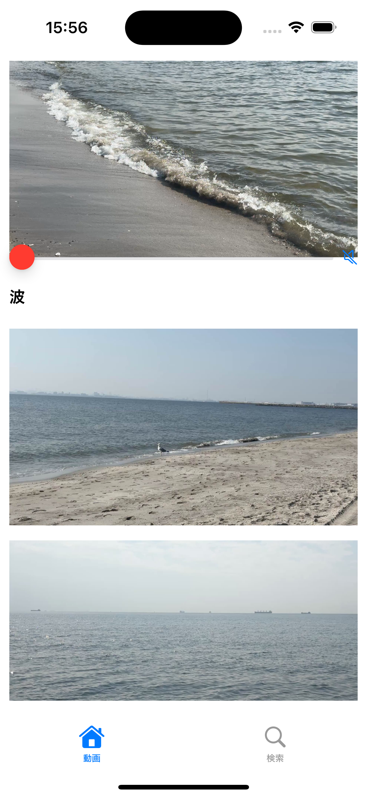
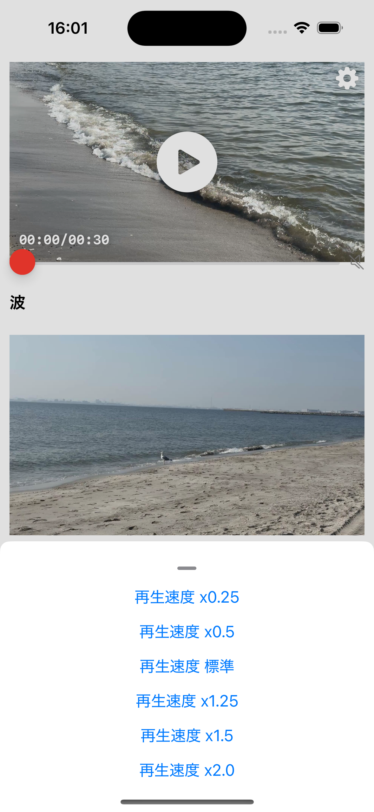
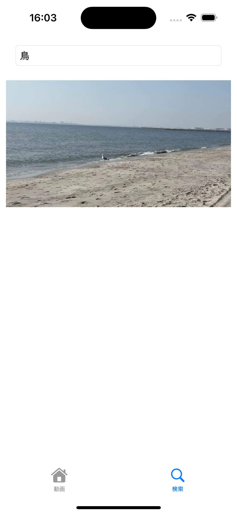

# 概要
本プロジェクトは、SwiftUIで作成したポートフォリオ用のアプリです。  
サーバーから取得した動画を再生するiOSアプリです。  
採用選考における技術スキルの参考として公開しています。

| 動画画面1 | 動画画面2 | 検索画面 |
|-------|-------|-------|
|  |  |  |

# サーバー
サーバーは[MovieStreamServer](https://github.com/suzukaze/MovieStreamServer)のレポジトリからインストールしてください。

#  ビルド
Xcode 16.4以上でビルドしてください。

# 技術
SwiftUI+MVVMを使用しています。  
非同期通信にはSwift Concurrency(await/async)を使用しています。  
